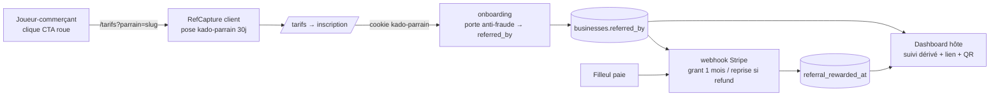

# Spine — Attribution boucle produit ↔ parrainage commerçant

Paradigme : **feature de câblage brownfield** — on branche un flux d'attribution
sur le parrainage commerçant *déjà existant*, sans introduire de second système.
Le spine fixe uniquement les invariants qui empêchent les unités (middleware,
onboarding, webhook, dashboard) de diverger.

## Invariants (Architecture Decisions)

### AD-1 — Canaux d'attribution séparés · `[ADOPTED]`
- **Binds :** comment l'attribution parrainage est transportée.
- **Rule :** le parrainage utilise un cookie **`kado-parrain`** distinct du cookie
  affilié **`kado-aff`**. Les deux chaînes restent indépendantes de bout en bout.
- **Prevents :** un `?parrain=<slug>` interprété comme code affilié → mauvaise
  attribution / mauvaise récompense.

### AD-2 — Point de capture unique (modèle `RefCapture`)
- **Binds :** où/quand l'attribution est captée.
- **Rule :** le cookie `kado-parrain=<slug>` est posé par un **composant client**
  calqué sur `components/RefCapture.tsx` (qui pose déjà `kado-aff`) — **pas** par
  `middleware.ts` (matcher limité à `/dashboard`, `/auth`). TTL **30 jours** ;
  **first-wins** (une visite ultérieure sans paramètre ne l'écrase pas). L'onboarding
  résout le parrain depuis `body.parrain` **ou** le cookie `kado-parrain` (comme il
  lit déjà `kado-aff`).
- **Prevents :** une capture qui dépend de la page d'entrée, donc incohérente.

### AD-3 — Source de vérité unique de l'attribution
- **Binds :** où vit le lien parrain→filleul.
- **Rule :** l'attribution s'écrit **exclusivement** dans `businesses.referred_by`
  (via `body.parrain` à l'onboarding, mécanique existante). **Aucune** nouvelle
  table d'attribution, **aucun** second flux de liaison.
- **Prevents :** deux systèmes de parrainage qui divergent.

### AD-4 — Mutation de la récompense confinée au webhook Stripe
- **Binds :** qui accorde / reprend la récompense et touche `referral_rewarded_at`.
- **Rule :** grant **et** reprise ne se font **que** dans le webhook Stripe. Grant
  au **1er paiement confirmé** du filleul ; **reprise** sur `charge.refunded` /
  `charge.dispute.created` survenant **< 14 j**. Aucun autre chemin ne mute la récompense.
- **Prevents :** double-grant, ou récompense conservée sur un paiement annulé.

### AD-5 — Anti-fraude évalué aux mêmes critères, aux deux portes
- **Binds :** où et comment la fraude est filtrée.
- **Rule :** parrain ≠ filleul sur **e-mail, téléphone, et client/carte Stripe** ;
  vérifié **à la liaison** (onboarding, blocage précoce) **et re-vérifié au grant**
  (webhook). Tout refus est **journalisé**. Mêmes critères aux deux portes.
- **Prevents :** une porte qui laisse passer ce que l'autre refuse.

### AD-6 — Le suivi hôte est dérivé, jamais dénormalisé
- **Binds :** d'où vient le comptage affiché à l'hôte.
- **Rule :** « nb de filleuls / mois gagnés » est **calculé en lecture** depuis
  `referred_by` + `referral_rewarded_at`. Pas de compteur maintenu à la main.
- **Prevents :** un compteur qui diverge de la réalité des données.

## Seed (vrai au démarrage, possédé par le code ensuite)

Stack ratifiée (existant) : Next.js App Router · Supabase (service_role serveur) ·
Stripe · Vercel · lib `qrcode`.

Points de contact (unités à construire/modifier) :

| Unité | Rôle dans la feature | État |
|---|---|---|
| `components/RefCapture.tsx` (ou jumeau) | poser `kado-parrain` sur `?parrain=` côté client (AD-2) | à étendre/cloner |
| `app/api/onboarding/route.ts` | lire cookie `kado-parrain` → `referred_by` + porte anti-fraude (AD-3, AD-5) | à étendre |
| `app/api/billing/webhook/route.ts` | grant + reprise + re-check fraude (AD-4, AD-5) | à étendre |
| `app/dashboard` + composant encart | lien + QR + suivi dérivé (AD-6) | à créer |
| `app/[slug]/Game.tsx` | CTA `?parrain=<slug>` | **livré** |
| migration `referral_blocks` | journal des refus de fraude | à créer `[HYPOTHÈSE]` |

## Deferred (hors de ce spine — décidés ailleurs / plus tard)
- Récompense cash, choix de récompense par l'hôte, plafond de mois par parrain.
- Affichage « Recommandé par [Nom] » sur `/tarifs` (v1.1).
- Canal Instagram de la boucle.
- Forme exacte de la table `referral_blocks` (colonnes/index) → décision au build.

## Invariants hérités
Aucun spine parent ; conventions héritées du code existant (voir *Seed*).
